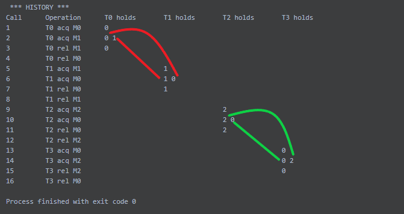

# Inhaltsverzeichnis
<!-- TOC depthFrom:1 depthTo:6 withLinks:1 updateOnSave:1 orderedList:0 -->

- [Inhaltsverzeichnis](#inhaltsverzeichnis)
- [GoodLock-Projektarbeit](#goodlock-projektarbeit)
	- [Einführung Projektarbeit](#einführung-projektarbeit)
- [Hintergrundmaterial und Recherchen](#hintergrundmaterial-und-recherchen)
	- [Wissenschaftliche Arbeiten/Paper](#wissenschaftliche-arbeitenpaper)
	- [Beispiele](#beispiele)
	- [Implementierungen](#implementierungen)
	- [Diskussionen und Erklärungen](#diskussionen-und-erklärungen)
- [Verwendung von ThreadSanitizer und dessen GoodLock Implementierung](#verwendung-von-threadsanitizer-und-dessen-goodlock-implementierung)
	- [Einführung TSan](#einführung-tsan)
	- [Problematiken](#problematiken)
	- [Unterstütze Plattformen und Datentypen](#unterstütze-plattformen-und-datentypen)
		- [Plattformen](#plattformen)
		- [Datentypen](#datentypen)
	- [Einrichtung unter Windows](#einrichtung-unter-windows)
	- [Ein Beispiel mit threads](#ein-beispiel-mit-threads)
	- [Eigenständige Implementierung in C++](#eigenständige-implementierung-in-c)
        - [Algorithmus](#algorithmus)
        - [Anwendung der Implementierung](#anwendung-der-implementierung)
        - [Fälle, die bei dieser Implementierung nicht abgedeckt sind](#fälle-die-bei-dieser-implementierung-nicht-abgedeckt-sind)
            - [Notation](#notation)
            - [false positive](#false-positive)
            - [false negative](#false-negative)
            - [Deadlock](#deadlock)
        - [Zusammenfassung der gewonnenen Erkenntnisse](#zusammenfassung-der-gewonnenen-erkenntnisse)

<!-- /TOC -->
# GoodLock-Projektarbeit
## Einführung Projektarbeit
Im Rahmen dieser Projektarbeit arbeiten Marie Fiederlein und Fabio Nocera gemeinsam am Thema GoodLock. Betreut wird das Thema von Herrn Prof. Dr. Martin Sulzmann.

GoodLock ist ein Algorithmus, welcher dazu dient Programmverhalten dynamisch zu analysieren und Deadlocks zu erkennen. Das Ziel ist es sich mit dem Algorithmus, der Funktionsweise, dem Einsatz und einer eigenen Implementierung zu beschäftigen.

Hierbei ist der schriftliche Teil in drei Teile untergliedert:

1. Hintergrundmaterial und Recherchen

2. Verwendung von ThreadSanitizer und GoodLock

3. Eigenständige Implementierung in C++

# Hintergrundmaterial und Recherchen
## Wissenschaftliche Arbeiten und Paper
- Der Algorithmus für die Detektion von Deadlocks und data Races mit maximal 2 Threads wird erklärt und in Java implementiert.
   - [Using Runtime Analysis to Guide Model Checking of Java Programs](<https://ti.arc.nasa.gov/m/pub-archive/177h/0177%20(Havelund).pdf>)
- Der Algorithmus für die Detektion von Deadlocks mit n Threads wird erklärt und in Java implementiert.
   - [Detecting Potential Deadlocks with Static Analysis and Run-Time Monitoring](https://www.research.ibm.com/haifa/Workshops/PADTAD2005/papers/article.pdf)
- Der Algorithmus des ThreadSanitizer wird erklärt und seine Einsatzgebiete vom Testen von multithreaded C++ Code aufgezeigt.
   - [ThreadSanitizer – data race detection in practice](https://static.googleusercontent.com/media/research.google.com/de//pubs/archive/35604.pdf)
- Es werden zwei Analyse Tools, ThreadSanitizer und ThreadSafety, die zum Testen von multithreaded Programmen genutzt werden, näher betrachtet und deren Vor- und Nachteile aufgezeigt.
   - [How Developers Use Data Race Detection Tools](https://static.googleusercontent.com/media/research.google.com/en//pubs/archive/43217.pdf)

## Beispiele
- Eine Beschreibung einiger der häufigsten Daten Races, die vom ThreadSanitizer erkannt werden.
   - [ThreadSanitizerPopularDataRaces](https://github.com/google/sanitizers/wiki/ThreadSanitizerPopularDataRaces)
- False Positive Fälle bei der Deadlock Erkennung:
   - [ThreadSanitizer gives false positive warning about Deadlock](https://gist.github.com/spetrunia/77274cf2d5848e0a7e090d622695ed4e)
   - [Thread Sanitizer false positive on lock-order-inversion (potential Deadlock)](https://github.com/google/sanitizers/issues/1419)
   - [False lock-order-inversion reports for locks taken in a single thread](https://github.com/google/sanitizers/issues/488)
   - [tsan: False positive for lock-order-inversion for lock cycles with asymmetrical unlocking](https://github.com/google/sanitizers/issues/814)
- False Negative Fälle bei der Deadlock Erkennung:
   - [Zwei Threads in Abhängigkeit](https://sulzmann.github.io/AutonomeSysteme/lec-deadlock.html#(3))
   - [Weitere häufige false Negatives werden beschrieben](https://groups.google.com/g/thread-sanitizer/c/mB73m6Nltaw)

## Implementierungen
- Implementierung verschiedener Sanitizer unter anderem den ThreadSanitizer in den Sprachen C++ und Go. Die zugrundeliegende Implementierung vom ThreadSanitizer ist aus dem LLVM-Project. Es wird sehr grob beschrieben, wie Tsan funktioniert.
   - [google/sanitizers](https://github.com/google/sanitizers)
   - [google/sanitizers/wiki/ThreadSanitizerAlgorithm](https://github.com/google/sanitizers/wiki/ThreadSanitizerAlgorithm)
- Die grundlegende Implementierung von ThreadSanitizer in C++ von LLVM. Die LLVM Compiler Infrastructure ist eine Sammlung von modularen und wiederverwendbaren Compilern und toolchain-Techniken.
   - [Docs](https://clang.llvm.org/docs/ThreadSanitizer.html)
   - [Codebase](https://github.com/llvm/llvm-project/tree/main/compiler-rt/lib/tsan)
- Tests aus dem Repository von LLVM.
   - [llvm-project/compiler-rt/test/tsan](https://github.com/llvm/llvm-project/tree/main/compiler-rt/test/tsan)

## Diskussionen und Erklärungen
- Es wird über den Speicherplatzbedarf für das Speichern von geteilten Variablen und/oder Zugriffen des gemeinsamen Lesens von TSan diskutiert und wie das Löschen beim Überlauf gelöst ist.
   - [Speicherverwaltung von Tsan für seine gespeicherten Variablen](https://groups.google.com/g/thread-sanitizer/c/mB73m6Nltaw)
- TSan entdeckt nur potenzielle Deadlocks. Falls tatsächlich ein Deadlock während des Tests auftritt, dann wird sich TSan aufhängen.
   - [Verhalten von TSan bei einem auftretenden Deadlock](https://groups.google.com/g/thread-sanitizer/c/g3aMe3IxVBQ)
- Es werden Videos und Präsentationen angegeben, um mehr Details zur Funktionalität von TSan zu erfahren.
   - [Erklärungen zur Funktionalität von TSan](https://groups.google.com/g/thread-sanitizer/c/HquBSCbzbyA)
- Talk über die Funktion des Go race detectors, welcher auf der Tsan Implementierung in LLVM basiert. Es wird auch die Funktionsweise von Tsan selbst erläutert.
   - [Looking inside a Race Detector](https://www.infoq.com/presentations/go-race-detector/)
- Präsentation über ThreadSanitizer v2.
   - [2012 LLVM Developers’ Meeting: K. Serebryany “MemorySanitizer, ThreadSanitizer. Scalable ...”](https://www.youtube.com/watch?v=HDgttiIvMxA)
   - [Slides](https://llvm.org/devmtg/2012-11/Serebryany_TSan-MSan.pdf)
- Der ThreadSanitizer v1 basiert auf Valgrind/Helgrind basiert. Das ist eine kleine Übersicht zu Helgrind.
   - [Helgrind: a thread error detector](https://valgrind.org/docs/manual/hg-manual.html#hg-manual.lock-orders)
- Präsentation darüber, warum Tsan und andere Sanitizer nicht ausreichend sind. Wenn die Sanitizer Bugs finden ist das schön, sie liefern allerdings keinen Beweis der Korrektheit. Es wird zusätzlich Fuzzing zum code hardening empfohlen.
   - [2015 LLVM Developers’ Meeting: K. Serebryany & P. Collingbourne "Beyond Sanitizers..."](https://www.youtube.com/watch?v=5K_uIda0tZU)

# Verwendung von ThreadSanitizer und dessen GoodLock Implementierung
## Einführung TSan
Der ThreadSanitizer ist Teil des [LLVM Projects](https://llvm.org/), einer Sammlung von modularen und wiederverwendbaren compiler und toolchain Technologien sowie Teil von [gcc](https://gcc.gnu.org/) und [clang](https://clang.llvm.org/).
Insbesondere ist der ThreadSanitizer Teil der Codebase von [compiler-rt](https://compiler-rt.llvm.org/) zusammen mit anderen Sanitizern, wie zum Beispiel der [AdressSanitizer](https://clang.llvm.org/docs/AddressSanitizer.html).
ThreadSanitizer übernimmt hier die Funktion eines Tools, welches [data races](https://docs.oracle.com/cd/E19205-01/820-0619/geojs/index.html) sowie [DeadLocks](https://docs.oracle.com/cd/E19205-01/820-0619/geokj/index.html) erkennt.\
Je nach Situation ist ein slowdown von 5x-15x sowie ein Speicher overhead von 5x-10x zu erwarten.

Bis heute ist ThreadSanitizer in der Betaphase, insgesamt aber dafür bekannt zuverlässig in großen C++ Projekten unter Verwendung von pthreads zu funktionieren.

## Problematiken
Der oben genannte slowdown und overhead kann je nach Anwendung kritisch sein, es ist zu empfehlen dies vorher zu prüfen.

Tsan bietet keinerlei Garantien dafür, dass data races gefunden werden und gefundene data races liefern keinen Beweis der Korrektheit ([K. Serebryany, Google](https://www.youtube.com/watch?v=5K_uIda0tZU)).
Trotz, dass der ThreadSanitizer mittlerweile ausgereift und häufig verwendet wird, ist er nach wie vor in der Betaphase, erfährt jedoch aktive Entwicklung.\
Die Deadlock Detection wird [Stand 2020, K. Serebryany, Google](https://github.com/google/sanitizers/issues/1258) seit circa 2015 leider nicht aktiv weiterentwickelt.
Darüber hinaus gibt es auch zwei Versionen im Repository [Deadlock_detector1](https://github.com/llvm/llvm-project/blob/main/compiler-rt/lib/sanitizer_common/sanitizer_deadlock_detector1.cpp) und [Deadlock_detector2](https://github.com/llvm/llvm-project/blob/main/compiler-rt/lib/sanitizer_common/sanitizer_Deadlock_detector2.cpp).
Diese liefern unterschiedliche Ergebnisse, insgesamt ist die [Deadlock Erkennung als Experimental](https://github.com/google/sanitizers/wiki/ThreadSanitizerDeadlockDetector) eingestuft.

Inwiefern diese Funktionalität im Vergleich zu der data race Erkennung des Tsan eine Anwendung in der Industrie erfährt, konnte leider nicht in Erfahrung gebracht werden.
Es ist außerdem nicht bekannt, in welchem Rahmen die Deadlock Erkennung funktional ist, das lässt sich aus mehreren Stellen des LLVM repositories ableiten.
[Insbesondere können keine Deadlocks erkannt werden, die wirklich passieren](https://github.com/llvm/llvm-project/blob/main/compiler-rt/test/tsan/must_deadlock.cpp).
Das liegt daran, dass die Überprüfung des Graphen und damit die Erkennung des Deadlocks nach pthread_mutex_lock ausgeführt wird und sich das Programm entsprechend schon im Deadlock befindet.

## Unterstütze Plattformen und Datentypen
### Plattformen

- Android aarch64, x86_64
- Darwin arm64, x86_64
- FreeBSD
- Linux aarch64, x86_64, powerpc64, powerpc64le
- NetBSD

### Datentypen
- ```pthread_mutex_*```
- ```pthread_rwlock_*```
- ```pthread_spin_*```

Anmerkung: Es wird std::thread verwendet. Dieser library liegt pthread zugrunde.

## Einrichtung unter Windows
Voraussetzung für die Anwendung von Tsan unter Windows ist [WSL/WSL2](https://docs.microsoft.com/de-de/windows/wsl/compare-versions) mit einer der unterstützten [Plattformen](#Plattformen) als Subsystem.
Gewählt wurde in unserem Fall WSL2 mit Ubuntu.

In Ubuntu ist es dann ausreichend ein paar Befehle im Terminal auszuführen.
1. ```sudo apt-get update``` sowie ```sudo apt-get upgrade``` um das System zu aktualisieren.
2. ```sudo apt-get install cmake``` zum installieren von [cmake](https://cmake.org/).
3. ```sudo apt-get install gdb``` zum installieren des [gdb](https://www.gnu.org/software/gdb/) debuggers.
4. ```sudo apt-get install build-essential``` um den [gcc compiler](https://gcc.gnu.org/) zu installieren.

Damit ist seitens Ubuntu alles eingerichtet. Um CLion dazu zu bringen, auf dem Subsystem zu kompilieren, kann man die von [JetBrains beschriebenen Schritte](https://www.jetbrains.com/help/clion/how-to-use-wsl-development-environment-in-product.html#wsl-tooclhain) befolgen.
Jetzt ist es noch nötig CMake mitzuteilen, dass wir mit aktiven ThreadSanitizer kompilieren möchten. Das geht, indem man die folgende Zeile zu [CMakeLists](CMakeLists.txt) hinzufügt:
```set(CMAKE_CXX_FLAGS "${CMAKE_CXX_FLAGS} -fsanitize=thread -g -O2")```.
Hierbei generiert ```-g``` [debug Informationen](https://www.rapidtables.com/code/linux/gcc/gcc-g.html) für den GDB debugger und ```-O2``` für den [Optimierungsgrad](https://gcc.gnu.org/onlinedocs/gcc/Optimize-Options.html).
Zum Schluss übergeben wir noch zwei Flags an Tsan.
- ```detect_deadlocks=1``` um die Deadlock Erkennung zu aktivieren.
- ```second_deadlock_stack=1``` um erweitere Informationsausgabe auf der Konsole zu aktivieren.

Es ist nun möglich mit Tsan zu kompilieren.

## Ein Beispiel mit threads
Das folgende Beispiel erzeugt einen für ThreadSanitizer potenziellen Deadlock mit zwei threads.

```c++
void test_ClassicDeadlock() {
    std::thread t0(help_Function_2Locks, 0);
    std::thread t1(help_Function_2Locks, 1);
    t0.join();
    t1.join();
}

void help_Function_2Locks(int number) {
    switch (number) {
        case 0:
            x.lock();
            y.lock();
            y.unlock();
            x.unlock();
            break;
        case 1:
            y.lock();
            x.lock();
            x.unlock();
            y.unlock();
            break;
	default:
	    break;
    }
}
```

Die Konsolenausgabe zeigt uns ebendies an:

```
==================
WARNING: ThreadSanitizer: lock-order-inversion (potential deadlock) (pid=13148)
  Cycle in lock order graph: M12 (0x558708eeb0c0) => M13 (0x558708eeb080) => M12

  Mutex M13 acquired here while holding mutex M12 in thread T1:
    #0 pthread_mutex_lock ../../../../src/libsanitizer/sanitizer_common/sanitizer_common_interceptors.inc:4165 (libtsan.so.0+0x526fc)
    #1 __gthread_mutex_lock /usr/include/x86_64-linux-gnu/c++/9/bits/gthr-default.h:749 (GoodLock_Projektarbeit+0x2efb)
    #2 std::mutex::lock() /usr/include/c++/9/bits/std_mutex.h:100 (GoodLock_Projektarbeit+0x2efb)
    #3 help_Function_2Locks(int) /mnt/c/Users/marie/CLionProjects/Goodlock-Projektarbeit/tests/test_tsan_deadlock_detection.cpp:100 (GoodLock_Projektarbeit+0x2efb)
    #4 void std::__invoke_impl<void, void (*)(int), int>(std::__invoke_other, void (*&&)(int), int&&) /usr/include/c++/9/bits/invoke.h:60 (GoodLock_Projektarbeit+0x4a41)
    #5 std::__invoke_result<void (*)(int), int>::type std::__invoke<void (*)(int), int>(void (*&&)(int), int&&) /usr/include/c++/9/bits/invoke.h:95 (GoodLock_Projektarbeit+0x4a41)
    #6 void std::thread::_Invoker<std::tuple<void (*)(int), int> >::_M_invoke<0ul, 1ul>(std::_Index_tuple<0ul, 1ul>) /usr/include/c++/9/thread:244 (GoodLock_Projektarbeit+0x4a41)
    #7 std::thread::_Invoker<std::tuple<void (*)(int), int> >::operator()() /usr/include/c++/9/thread:251 (GoodLock_Projektarbeit+0x4a41)
    #8 std::thread::_State_impl<std::thread::_Invoker<std::tuple<void (*)(int), int> > >::_M_run() /usr/include/c++/9/thread:195 (GoodLock_Projektarbeit+0x4a41)
    #9 <null> <null> (libstdc++.so.6+0xd6de3)

  Mutex M12 previously acquired by the same thread here:
    #0 pthread_mutex_lock ../../../../src/libsanitizer/sanitizer_common/sanitizer_common_interceptors.inc:4165 (libtsan.so.0+0x526fc)
    #1 __gthread_mutex_lock /usr/include/x86_64-linux-gnu/c++/9/bits/gthr-default.h:749 (GoodLock_Projektarbeit+0x2ee7)
    #2 std::mutex::lock() /usr/include/c++/9/bits/std_mutex.h:100 (GoodLock_Projektarbeit+0x2ee7)
    #3 help_Function_2Locks(int) /mnt/c/Users/marie/CLionProjects/Goodlock-Projektarbeit/tests/test_tsan_deadlock_detection.cpp:99 (GoodLock_Projektarbeit+0x2ee7)
    #4 void std::__invoke_impl<void, void (*)(int), int>(std::__invoke_other, void (*&&)(int), int&&) /usr/include/c++/9/bits/invoke.h:60 (GoodLock_Projektarbeit+0x4a41)
    #5 std::__invoke_result<void (*)(int), int>::type std::__invoke<void (*)(int), int>(void (*&&)(int), int&&) /usr/include/c++/9/bits/invoke.h:95 (GoodLock_Projektarbeit+0x4a41)
    #6 void std::thread::_Invoker<std::tuple<void (*)(int), int> >::_M_invoke<0ul, 1ul>(std::_Index_tuple<0ul, 1ul>) /usr/include/c++/9/thread:244 (GoodLock_Projektarbeit+0x4a41)
    #7 std::thread::_Invoker<std::tuple<void (*)(int), int> >::operator()() /usr/include/c++/9/thread:251 (GoodLock_Projektarbeit+0x4a41)
    #8 std::thread::_State_impl<std::thread::_Invoker<std::tuple<void (*)(int), int> > >::_M_run() /usr/include/c++/9/thread:195 (GoodLock_Projektarbeit+0x4a41)
    #9 <null> <null> (libstdc++.so.6+0xd6de3)

  Mutex M12 acquired here while holding mutex M13 in thread T2:
    #0 pthread_mutex_lock ../../../../src/libsanitizer/sanitizer_common/sanitizer_common_interceptors.inc:4165 (libtsan.so.0+0x526fc)
    #1 __gthread_mutex_lock /usr/include/x86_64-linux-gnu/c++/9/bits/gthr-default.h:749 (GoodLock_Projektarbeit+0x2e57)
    #2 std::mutex::lock() /usr/include/c++/9/bits/std_mutex.h:100 (GoodLock_Projektarbeit+0x2e57)
    #3 help_Function_2Locks(int) /mnt/c/Users/marie/CLionProjects/Goodlock-Projektarbeit/tests/test_tsan_deadlock_detection.cpp:106 (GoodLock_Projektarbeit+0x2e57)
    #4 void std::__invoke_impl<void, void (*)(int), int>(std::__invoke_other, void (*&&)(int), int&&) /usr/include/c++/9/bits/invoke.h:60 (GoodLock_Projektarbeit+0x4a41)
    #5 std::__invoke_result<void (*)(int), int>::type std::__invoke<void (*)(int), int>(void (*&&)(int), int&&) /usr/include/c++/9/bits/invoke.h:95 (GoodLock_Projektarbeit+0x4a41)
    #6 void std::thread::_Invoker<std::tuple<void (*)(int), int> >::_M_invoke<0ul, 1ul>(std::_Index_tuple<0ul, 1ul>) /usr/include/c++/9/thread:244 (GoodLock_Projektarbeit+0x4a41)
    #7 std::thread::_Invoker<std::tuple<void (*)(int), int> >::operator()() /usr/include/c++/9/thread:251 (GoodLock_Projektarbeit+0x4a41)
    #8 std::thread::_State_impl<std::thread::_Invoker<std::tuple<void (*)(int), int> > >::_M_run() /usr/include/c++/9/thread:195 (GoodLock_Projektarbeit+0x4a41)
    #9 <null> <null> (libstdc++.so.6+0xd6de3)

  Mutex M13 previously acquired by the same thread here:
    #0 pthread_mutex_lock ../../../../src/libsanitizer/sanitizer_common/sanitizer_common_interceptors.inc:4165 (libtsan.so.0+0x526fc)
    #1 __gthread_mutex_lock /usr/include/x86_64-linux-gnu/c++/9/bits/gthr-default.h:749 (GoodLock_Projektarbeit+0x2e43)
    #2 std::mutex::lock() /usr/include/c++/9/bits/std_mutex.h:100 (GoodLock_Projektarbeit+0x2e43)
    #3 help_Function_2Locks(int) /mnt/c/Users/marie/CLionProjects/Goodlock-Projektarbeit/tests/test_tsan_deadlock_detection.cpp:105 (GoodLock_Projektarbeit+0x2e43)
    #4 void std::__invoke_impl<void, void (*)(int), int>(std::__invoke_other, void (*&&)(int), int&&) /usr/include/c++/9/bits/invoke.h:60 (GoodLock_Projektarbeit+0x4a41)
    #5 std::__invoke_result<void (*)(int), int>::type std::__invoke<void (*)(int), int>(void (*&&)(int), int&&) /usr/include/c++/9/bits/invoke.h:95 (GoodLock_Projektarbeit+0x4a41)
    #6 void std::thread::_Invoker<std::tuple<void (*)(int), int> >::_M_invoke<0ul, 1ul>(std::_Index_tuple<0ul, 1ul>) /usr/include/c++/9/thread:244 (GoodLock_Projektarbeit+0x4a41)
    #7 std::thread::_Invoker<std::tuple<void (*)(int), int> >::operator()() /usr/include/c++/9/thread:251 (GoodLock_Projektarbeit+0x4a41)
    #8 std::thread::_State_impl<std::thread::_Invoker<std::tuple<void (*)(int), int> > >::_M_run() /usr/include/c++/9/thread:195 (GoodLock_Projektarbeit+0x4a41)
    #9 <null> <null> (libstdc++.so.6+0xd6de3)

  Thread T1 (tid=13150, finished) created by main thread at:
    #0 pthread_create ../../../../src/libsanitizer/tsan/tsan_interceptors_posix.cpp:962 (libtsan.so.0+0x5ea79)
    #1 std::thread::_M_start_thread(std::unique_ptr<std::thread::_State, std::default_delete<std::thread::_State> >, void (*)()) <null> (libstdc++.so.6+0xd70a8)
    #2 main /mnt/c/Users/marie/CLionProjects/Goodlock-Projektarbeit/tests/test_tsan_deadlock_detection.cpp:53 (GoodLock_Projektarbeit+0x2a73)

  Thread T2 (tid=13151, running) created by main thread at:
    #0 pthread_create ../../../../src/libsanitizer/tsan/tsan_interceptors_posix.cpp:962 (libtsan.so.0+0x5ea79)
    #1 std::thread::_M_start_thread(std::unique_ptr<std::thread::_State, std::default_delete<std::thread::_State> >, void (*)()) <null> (libstdc++.so.6+0xd70a8)
    #2 main /mnt/c/Users/marie/CLionProjects/Goodlock-Projektarbeit/tests/test_tsan_deadlock_detection.cpp:53 (GoodLock_Projektarbeit+0x2a73)

SUMMARY: ThreadSanitizer: lock-order-inversion (potential deadlock) /usr/include/x86_64-linux-gnu/c++/9/bits/gthr-default.h:749 in __gthread_mutex_lock
==================
ThreadSanitizer: reported 1 warnings

Process finished with exit code 66
```

## Eigenständige Implementierung in C++
### Algorithmus
Die Idee des Goodlock Algorithmus ist es, mithilfe eines Graphen durch Zyklen, Deadlocks zu erkennen.
Genauer gesagt, gibt es einen Graphen mit einer Adjazenzmatrix, der sich alle Kanten zwischen den Mutexen merkt.
Jedes Mal, wenn ein Thread ein Mutex acquired oder released, wird der Graph aktualisieren.
Falls über einen Thread ein Mutex gelockt werden soll, nachdem schon ein anderes Mutex gelockt wurde, wird die Adjazenzmatrix aktualisiert.

Zum Beispiel: ein Thread möchte Mutex 1, nachdem er Mutex 0 gelockt hat, locken -> Kante in der Zeile 0 und in Spalte 1 wird auf 1 gesetzt.

Das Überprüfen erfolgt durch das Iterieren über die Adjazenzmatrix.
Dabei wird für jeden Eintrag mithilfe seiner Nachbarn geprüft, ob er einen Zyklus bildet.
Falls wir einen Zyklus gefunden haben, gibt es einen potenziellen Deadlock und wir geben eine Warnung aus.
Dieser potenzielle Deadlock kann, je nachdem in welcher Reihenfolge die Threads durchgeführt werden, zu einem tatsächlichen Deadlock kommen.

Zum Beispiel:
  Thread 0 und Thread 1 werden nahezu gleichzeitig ausgeführt.\
  Thread 0 möchte zuerst Mutex 0 und dann Mutex 1 locken.\
  Thread 1 möchte zuerst Mutex 1 und dann Mutex 0 locken.
  => Potenzieller Deadlock

In dem Falle, dass es tatsächlich zu einem Deadlock kommt, kann dieser Deadlock über den Algorithmus nicht mehr erkannt werden, weil die Threads aufeinander warten.

### Anwendung der Implementierung
Anhand des Testbeispiels test_FourThreads_MoreCycles() wird die Anwendung erklärt.\
Im Beispiel werden insgesamt 4 Threads mit unterschiedlicher Lockreihenfolge mit 3 Mutexen aufgerufen.\
Am Ende der Ausführung werden immer INFO, Lock graph und HISTORY ausgegeben.
Diese drei Ausgaben geben Informationen über die Ausführung der Threads, deren gelockten Mutexe, sowie, ob es mindestens einen Zyklus gibt.

- In der INFO steht, welche Threads am Ende noch welche Mutexe gelockt haben.\
  Da im Beispiel alle Threads ihre Mutexe am Ende releasen, hält kein Thread nach der Ausführung noch ein Mutex.
```
*** INFO ***
Thread 0 holds the following locks:
Thread 1 holds the following locks:
Thread 2 holds the following locks:
Thread 3 holds the following locks:
```
- Der LOCKGRAPH gibt Auskunft, welche Mutexe über Threads verschachtelt gelockt wurden.\
  Wenn es eine Kante von Mutex x zu Mutex y und eine Kante in die andere Richtung gibt, dann gibt es ein Zyklus und eine Fehlermeldung wird ausgegeben.\
  In diesem Beispiel gibt es zwei Zyklen und die Fehlermeldung wird ausgegeben.\
  Der erste Zyklus ist zwischen Mutex 0 und Mutex 1.\
  Der zweite Zyklus ist zwischen Mutex 0 und Mutex 2.
```
*** LOCKGRAPH ***
0 --> 1
0 --> 2
1 --> 0
2 --> 0
*** cycle => potential deadlock !!! ***
```
- Mit der HISTORY kann nachvollzogen werden, welche Operation, welcher Thread mit welchem Mutex, in einer bestimmten Reihenfolge, durchgeführt hat.\
  Beispielhaft werden nun die ersten 4 Zeilen erklärt. Das gilt jedoch für jede weitere Zeile auch.\
  Beim Aufruf 1 acquired der Thread T0 das Mutex M0\
  Beim Aufruf 2 acquired der Thread T0 das Mutex M1\
  Beim Aufruf 3 released der Thread T0 das Mutex M1\
  Beim Aufruf 4 released der Thread T0 das Mutex M0
```
*** HISTORY ***
Call      Operation      T0 holds       T1 holds       T2 holds       T3 holds
1         T0 acq M0      0
2         T0 acq M1      0 1
3         T0 rel M1      0
4         T0 rel M0
5         T1 acq M1                     1
6         T1 acq M0                     1 0
7         T1 rel M0                     1
8         T1 rel M1
9         T2 acq M2                                    2
10        T2 acq M0                                    2 0
11        T2 rel M0                                    2
12        T2 rel M2
13        T3 acq M0                                                   0
14        T3 acq M2                                                   0 2
15        T3 rel M2                                                   0
16        T3 rel M0

Process finished with exit code 0
 ```
In dieser Ausgabe sind die Zyklen markiert. Das ist jedoch kein Teil der Implementierung, sondern dient nur zur Veranschaulichung.



### Fälle, die bei dieser Implementierung nicht abgedeckt sind
Die Fälle sind unter anderem in der [Testklasse](tests/test_my_deadlock_detection.cpp) implementiert und ergeben die gleichen falschen Ausgaben wie beim TSan.\
#### Notation
  | Ausdruck | Bedeutung
  |:---------|:-------|
  | Lock: 0 -> 1| Zuerst wird das Mutex 0 und anschließend Mutex 1 vom aufrufenden Thread gelocked
  | Unlock: 1 -> 0 | Zuerst wird das Mutex 1 und anschließend das Mutex 0 vom aufrufenden Thread entlocked
  | Lock: 0 -> 1 -> 2 | Zuerst wird das Mutex 0, dann das Mutex 1 und dann das Mutex 2 vom aufrufenden Thread gelocked

#### false positive
- Die Implementierung beachtet nicht, welcher Thread, welches Mutex aufruft.\
  So wird bei einem Aufruf mit einem Thread bei 2 Aufrufen in umgekehrter Lockreihenfolge mit zwei Mutexen auch eine Warnmeldung ausgegeben.\
  Obwohl dieser Zyklus mit einem Thread zu keinem Problem führt.

  | Aufruf | Lock | Unlock |
  |:-------------------:|:------------:|:----------------:|
  | Erster Aufruf | 0 -> 1 | 1 -> 0
  | Zweiter Aufruf | 1 -> 0 | 0 -> 1

- Die Implementierung beachtet die Zeitabstände nicht.\
  So wird bei Aufrufen mit zwei Threads, die mit einer Sekunde Verzögerung zwei Mutexe in umgekehrter Lockreihenfolge locken wollen, eine Warnmeldung ausgegeben.\
  Obwohl dieser Zyklus durch die Zeitverzögerung nicht möglich ist.
  
  | Aufruf | Lock | Unlock |
  |:-------------------:|:------------:|:----------------:|
  | Aufruf mit Thread 0: | 0 -> 1 | 1 -> 0
  | Thread 1 schläft| | |
  | Aufruf mit Thread 1: | 1 -> 0 | 0 -> 1

- Die Implementierung beachtet nicht, ob ein Zyklus tatsächlich zustande kommen kann.\
  So wird bei zwei Aufrufen mit zwei Threads, die beide zuerst Mutex 0 locken und danach zwei andere Mutexe in umgekehrter Lockreihenfolge locken, eine Warnmeldung ausgegeben.\
  Obwohl dieser Zyklus nicht möglich ist, da Thread 1 auf Thread 0 warten wird, bis dieser Mutex 0 wieder freigibt, bevor er andere Mutexe lockt.
  
  | Aufruf | Lock | Unlock |
  |:-------------------:|:------------:|:----------------:|
  | Aufruf mit Thread 0: | 0 -> 1 -> 2 | 2 -> 1 -> 0
  | Aufruf mit Thread 1: | 0 -> 2 -> 1 | 1 -> 2 -> 0

#### false negative
- Die Implementierung erkennt keine verschachtelten Threads und deren Abhängigkeit zueinander.\
  So wird bei einem Aufruf mit Thread 0 und seinem Subthread, die die Mutexe in umgekehrter Lockreihenfolge wie ein anderer Thread 1 locken, keine Warnmeldung ausgegeben.\
  Obwohl hier ein Zyklus und dadurch ein Deadlock entstehen kann.

  | Aufruf | Lock | Unlock |
  |:-------------------:|:------------:|:----------------:|
  | Aufruf mit Thread 0: | 0 und starte Thread subThread | 0
  | Aufruf mit Thread subThread: | 1 | 1
  | Aufruf mit Thread 1: | 1 -> 0 | 0 -> 1

#### Deadlock
- Die Implementierung erkennt keinen Deadlock, wenn das Programm tatsächlich, während der Ausführung, in ein Deadlock endet.\
  So bleibt bei einem Aufruf mit Thread, das Mutex 0 lockt und dann ein Subthread startet, welches Mutex 1 und 0 locken möchte, in einem Deadlock stecken.

  | Aufruf | Lock | Unlock |
  |:-------------------:|:------------:|:----------------:|
  | Aufrufender Thread: | 0 | 0
  | Aufruf mit subThread: | 0 -> 1 | 1 -> 0

### Zusammenfassung der gewonnenen Erkenntnisse
Die Implementierung kann potenzielle Deadlocks erkennen, trotzdem könnte man sie durch Erweiterungen weiter optimieren. Im Rahmen dieser Projektarbeit wurde das nicht verfolgt.

Bei dieser Implementierung acquiren Threads die Mutexe, jedoch wird diese Information nicht weiter verarbeitet.\
Indem man diese Informationen im Algorithmus mitverwenden würde, könnte man einige der [oben genannten Fälle](#fälle-die-bei-dieser-implementierung-nicht-abgedeckt-sind), ausmerzen. Diese würden dann eine korrekte Ausgabe liefern.\
Ein Beispiel dafür ist, dass eine Warnmeldung ausgegeben wird, auch wenn nur ein Thread jeweils zwei Mutexe in umgekehrter Reihenfolge lockt.

Ein weiterer Punkt ist, dass die Abhängigkeit von verschachtelten Threads und deren gelockten Mutexen nicht erkannt wird.\
Das könnte man lösen, indem man die Thread ID vom äußeren Thread dem inneren Thread als Information mitgibt.
Denn dann kann diese Zusatzinformation und somit die Abhängigkeiten beim Überprüfen auf Zyklen mitberücksichtigt werden.

Zum Schluss gibt es noch das Problem, dass das Programm in einen tatsächlichen Deadlock geraten kann. Ist das der Fall, so kann selbstverständlich auch keine Ausgabe erfolgen.\
Das liegt darin begründet, dass der Algorithmus erst am Ende auf mögliche Zyklen prüft. Da wir nicht zum Ende kommen, wird nichts ausgegeben.\
Ein Lösungsansatz beschäftigen sich mehr mit der Vermeidung eines kritischen Abschnitts.
Zum Beispiel, indem man vorher prüft, ob bei der geplanten Aufrufreihenfolge (des nächsten acquires), ein Zyklus im Graph entstehen würde.

Alle Optimierungen würden bessere Ergebnisse liefern, jedoch auch einen gewissen Overhead mit sich bringen.
